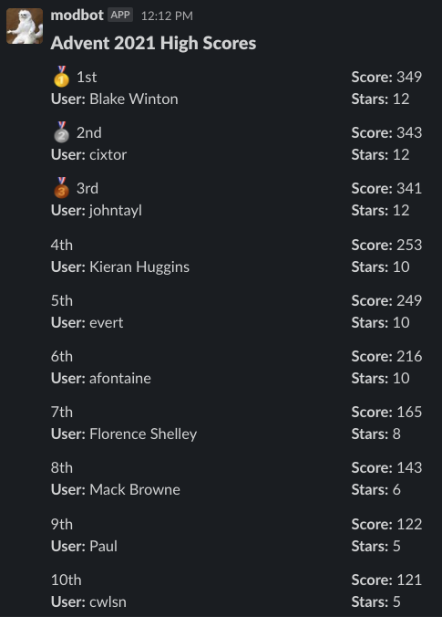

# advent-bot

## Description

This repo is responsible for updating the TorontoJS #advent channel with the Advent of Code highscores for the top 10. Although this could be easily changed to something else if someone wants to fork it.

## Technologies

Netlify Functions + Netlify Environment Variables
GitHub Actions + GitHub Secrets

## How it works

A GitHub action is triggered through one of two ways:

- Manual Trigger
- CRON at 12:02 PM daily during December.

The GitHub action will do a curl request which passes a secret header (stored in GitHub secrets) to the Netlify function URL (also stored as a secret).

The Netlify Function will first verify the secret which is also stored on Netlify environment variables and if it does not match, will respond back a 401. This is to prevent misuse of the API.

Then it will reach out to the Advent of Code API for the given year and leaderboard ID (both stored as environment variables).

After receiving the data, it will sort by `local_score` which is the Private Leaderboard Score, and return the top 10.

The top 10 members are then mapped over to create (https://app.slack.com/block-kit-builder)[Slack Blocks] to send a formatted message in Slack.

Lastly, using (https://slack.dev/bolt-js/concepts)[@Slack/Bolt] this will send a message in Slack (TorontoJS) to the #advent channel with the formatted slack message. Slack Bot credentials are stored on Netlify.

## Example Screenshot

